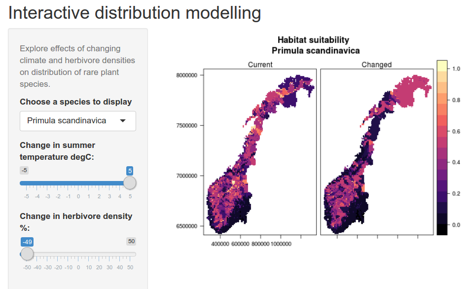

---
output:
  github_document:
    toc: true
    toc_depth: 6
---

<!-- README.md is generated from README.Rmd. Please edit that file -->

```{r, include = FALSE}
knitr::opts_chunk$set(
  collapse = TRUE,
  comment = "#>",
  fig.path = "man/figures/README-",
  out.width = "100%"
)
```

# sdmShiny

<!-- badges: start -->
<!-- badges: end -->

Last update:
```{r}
Sys.time()
```

This project is for disseminating the species distribution modeling work done in James Speed's group at the NTNU University Museum. We will use web-based Shiny apps to present distribution maps of several species and allow these to change with the predictions of the SDM as the user tweaks the parameters for climate and herbivory. 
The Shiny app will look something like this:



## Installation
Developers should clone the repo and work from there.One can also install the development version from [GitHub](https://github.com/) with:
```{r, eval = F}
install.packages("devtools")
devtools::install_github("anders-kolstad/sdmShiny")
```
## Example application
Follow this link
https://anderskolstad.shinyapps.io/demoSDM/


# Documentation
This section explains the workflow that ended up the the shiny app. The r project is arranged as an r package. All r code such as functions are in the 'data' folder. Large files around 100mb or greater, or unessential raster files etc., are in the data/large/ folder whihc is not pushed (it's in the .gitignore file) and therefore only exists locally with Anders.

##  Get species list
This function  produces a list of species that we will later use to harvest occurence data from gbif. More on this later.
```{r, eval = T}
source("./R/spList.R")
mySpecies <- sl()
head(mySpecies)

# alternatively
# mySpecies(df = TRUE)
```

## Environmental data 
### Overview
The alpine red-listed species paper used the following IVs, in the approximate order of importance:


* bio10 (temperature)
* bio12 (precipitation)
* soil ph
* Tundraherbivores - the combined metabolic biomass of sheep aand reindeer tundraherbivores
* bio15 (precipitation seasonality)
* AR50 categorical land-use classes (how many levels I don't know)


The 'forest paper' used these:

* bio10
* bio12
* Forest type (three levels, from AR50)
* soil pH
* Cervid densities...

### Existing raster stacks
#### The 'alpine paper'

From the alpine red-listed species paper, I got this sent over from James:
```{r}
IV <- raster::stack("data/large/selectvars.grd")
names(IV)
```
The first layer is the combined metabolic biomas of reindeer (wild and semi-domesticated) and sheep from the year 1999. I will use this later, but not the worldclim variable (see below). The resolution is 10km.
 
```{r}
#reindeerSheep <- IV[[1]]
#writeRaster(reindeerSheep, 'data/large/reindeerSheep')
reindeerSheep <- raster::stack('data/large/reindeerSheep.grd')
rm(IV)
raster::plot(reindeerSheep)
```

#### The 'forest' paper

From another of James' projects there is a file already collated with environmental data. It was downloaded from NTNU box: https://ntnu.app.box.com/s/wcmr0dgoyz2yu6ielw6er1pm7h0gaisa/file/393633279036

```{r}
PredVars <- raster::stack("data/large/PredictorVariables.grd")
names(PredVars)[20:25]<-c('Elevation','Land_Cover','Forest_Type','Forest_Productivity','Vegetation_Type','SoilpH')
names(PredVars)
```

Info

* This file does not contain reindeer, muskox, or livestock densities.
* ar50 maps are land use classes, including forest productivity (skogbon) and dominating forest tree species (treslag)
* bio1 to bio19 are worldclim variables. Only bio 10 and12 are used in the publication (bio15 is used in the 'alpine paper').
* resolution is 1km
* geonode is soil pH (soilgrids.org). The units are ph * 10.

```{r}
PredVars$SoilpH <- PredVars$SoilpH/10
```

##### Ratify categorical layers

I need to convert some layers from continous to categorial.

###### Land cover
```{r}
PredVars$Land_Cover <- raster::ratify(PredVars$Land_Cover) # essentially just as.factor(x)
ratlc               <- raster::levels(PredVars$Land_Cover)[[1]]
ratlc$Land_Cover <- c("Built-up",
                                    "Agricultural",
                                    "Forest",
                                    "Open-natural vegetation",
                                    "Mires",
                                    "Glaciers/Ice/Snow",
                                    "Freshwater",
                                    "Sea",
                                    "NA")
levels(PredVars$Land_Cover) <- ratlc
rasterVis::levelplot(PredVars$Land_Cover)

```

###### Forest productivity
```{r}
raster::levels(raster::ratify(PredVars$Forest_Productivity))
```
We don't want levels 98 and 99. Class 99 = 'ikke registrert'. 
```{r}
PredVars$Forest_Productivity[PredVars$Forest_Productivity>18]<-NA
PredVars$Forest_Productivity <- 
  raster::ratify(PredVars$Forest_Productivity)

ratlcp <- raster::levels(PredVars$Forest_Productivity)[[1]]
ratlcp[['Forest_Productivity']] <- 
  c('Unproductive',
    'Low',
    'Medium',
    'High')

levels(PredVars$Forest_Productivity) <- ratlcp
rasterVis::levelplot(PredVars$Forest_Productivity)
```

###### Forest type
```{r}
raster::levels(raster::ratify(PredVars$Forest_Type))
```
Deleting class 98 and 99 as above, but also 39 although I', not sure what that is...

```{r}
PredVars$Forest_Type[PredVars$Forest_Type>33]<-NA
PredVars$Forest_Type<-raster::ratify(PredVars$Forest_Type)
ratlct<-raster::levels(PredVars$Forest_Type)[[1]]
ratlct[['ForestType']] <-
  c('Coniferous','Deciduous','Mixed')
levels(PredVars$Forest_Type) <- ratlct
rasterVis::levelplot(PredVars$Forest_Type)
```

### Worldclim data and DTM
Worldclim was updated jan 2020, so I can get the bioclim variables again. This is a dataset of interpolated climate variables for the whole world at high resolution (0.5 arc minutes). It is build on data from 1970 onwards and so is not representing any one year. I need to download it as three tiles before merging these together. I will save each tile, but only the two variable bio10 and bio12, Mean Temperature of Warmest Quarter and Annual Precipitation, respectively.
First, let's delete the old bioclim variables, and also the cervid density data for all years exept the one we're going to use, which is 1999 (closest to the mean data of the species occurence records). 
```{r}
PredVars <- PredVars[[c(21:23, 25, 31, 39, 47)]]
```

```{r, eval = T}
# first tile
#Norbioclim<-getData('worldclim',var='bio',res=0.5,lon=5,lat=60) # approx 3 min
#Norbioclim <- Norbioclim[[c(10,12)]]
#writeRaster(Norbioclim,'data/large/Norbioclim')
Norbioclim <- raster::stack("data/large/Norbioclim.grd")
raster::plot(Norbioclim)
```

```{r}
# second tile
#Norbioclim1<-getData('worldclim',var='bio',res=0.5,lon=5,lat=70)
#Norbioclim1 <- Norbioclim1[[c(10,12)]]
#writeRaster(Norbioclim1,'data/large/Norbioclim1')
Norbioclim1 <- raster::stack("data/large/Norbioclim1.grd")
raster::plot(Norbioclim1)
```

```{r}
#third tile
#Norbioclim2<-getData('worldclim',var='bio',res=0.5,lon=40,lat=70)
#Norbioclim2 <- Norbioclim2[[c(10,12)]]
#writeRaster(Norbioclim2,'data/large/Norbioclim2')
Norbioclim2 <- raster::stack("data/large/Norbioclim2.grd")
raster::plot(Norbioclim2)
```

Then I merge these together.
```{r}
mergclim<-raster::merge(Norbioclim,Norbioclim1)
mergclim1<-raster::merge(mergclim,Norbioclim2)
raster::plot(mergclim1)
```

Now I get a DTM for Norway to be used as an IV, but also to crop the wordclim data.
```{r}
#Norelev<-getData('alt',country='NOR', res = 0.5) # 0.86 km2
#names(Norelev) # "NOR_msk_alt"
#writeRaster(Norelev, "data/large/Norelev") # 20mb
Norelev <- raster::stack("data/large/Norelev.grd")
raster::plot(Norelev)
```

Then I crop the worldclim data
```{r}
cropclim<-raster::crop(mergclim1,Norelev)
raster::plot(cropclim)
```

That took care of the extent. Now I want to put all cells that are outside the DTM as NA also in the climate layers
```{r}
Norclimdat<-raster::mask(cropclim,Norelev)
raster::plot(Norclimdat)
```

I can put these two together.
```{r}
# NorClimElev<-stack(Norclimdat,Norelev)
# names(NorClimElev)<-c("temp", "prec", "elev")
# writeRaster(NorClimElev,'data/NorClimElev') # only 60 mb so shold be able to go on GitHub
NorClimElev <- raster::stack('data/NorClimElev.grd')
NorClimElev
```

#### Combine all IVs
Now I can get all the IV layers on the same projection and stack them in a single file.
```{r, eval = F}
names(PredVars)
PredVars@crs       # +proj=utm +zone=32 +ellps=GRS80 +units=m +no_defs 
reindeerSheep@crs  # +proj=utm +zone=32 +datum=WGS84 +units=m +no_defs +ellps=WGS84 +towgs84=0,0,0 
NorClimElev@crs    # +proj=longlat +datum=WGS84 +ellps=WGS84 +towgs84=0,0,0 
```

I'm going to use UTM32 projection because the maps look better (more familiar) than with latlon. For the worldclim data and the reindeerSheep data there will also be a resampling. I'm also going to delete some layers I don't need and save it all as IV (overwriting previous name).
```{r}
newproj <- "+proj=utm +zone=32 +datum=WGS84 +units=m +no_defs +ellps=WGS84 +towgs84=0,0,0"
PredVars2          <- raster::projectRaster(PredVars, crs = newproj, method='bilinear')
reindeerSheep2     <- raster::projectRaster(reindeerSheep, PredVars2[[1]], method='bilinear')
NorClimElev2       <- raster::projectRaster(NorClimElev, PredVars2[[1]], method='bilinear')
IV                 <- raster::stack(PredVars2, reindeerSheep2, NorClimElev2)
# writeRaster(IV, 'data/IV', overwrite=TRUE) # 83 MB
myIVs              <- raster:: stack('data/IV.grd')
names(myIVs)
```

## Occurence data
To get occurence data I will use the gbif function in the dismo package. It can only handle one species at the time, so I will need to make a for-loop.

```{r}
head(mySpecies)
```
This is my species list. I will probably need to to some cleaning, perhaps using 'taxize' or somethin similar. James used the rgbif package, which require I think taxonIDs, as well as login credential to gbif.

As a test I will use a shorter list of just two.

```{r}
mySpecies2 <- mySpecies[c(1,5)]
```
Lets do a test loop without downloading anything, just seeing how many records there are.

Work in progress....

myO <- data.frame(species = mySpecies2, 
                  No.occurences = NA)

for(i in length(mySpecies2)){
  myName  <- mySpecies2[i]
  myName2 <- stringr::str_split(myName, " ")[[1]]
  myO$No.occurences[myO$species == i]     <- dismo::gbif(myName2[1], myName2[2], download = F) 
}


