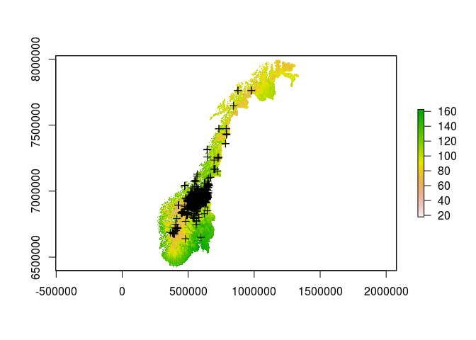
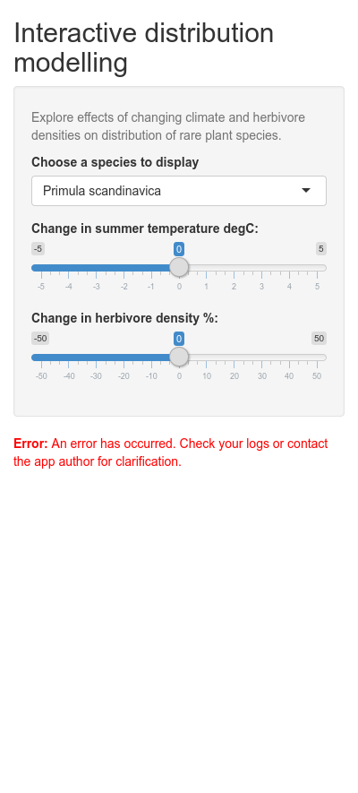

<!-- README.md is generated from README.Rmd. Please edit that file -->
sdmShiny
========

<!-- badges: start -->
<!-- badges: end -->
This project is for disseminating the species distribution modeling work done in James Speed's group at the NTNU University Museum. We will use web-based Shiny apps to present distribution maps of several species and allow these to change with the predictions of the SDM as the user tweaks the parameters for climate and herbivory. 

Installation
------------

Install the development version from [GitHub](https://github.com/) with:

``` r
# install.packages("devtools")
#devtools::install_github("anders-kolstad/sdmShiny")
```

Example
-------

first: include\_app

``` r
knitr::include_app("https://anderskolstad.shinyapps.io/demoSDM/", height = "200px")
```

<a href="https://anderskolstad.shinyapps.io/demoSDM/" target="_blank"></a>

then: include\_url

``` r
knitr::include_url("https://anderskolstad.shinyapps.io/demoSDM/", height = "200px")
```

<a href="https://anderskolstad.shinyapps.io/demoSDM/" target="_blank"></a>

Example
-------

This is a basic example which shows you how to solve a common problem:

``` r
#library(sdmShiny)
## basic example code
```

What is special about using `README.Rmd` instead of just `README.md`? You can include R chunks like so:

``` r
summary(cars)
#>      speed           dist       
#>  Min.   : 4.0   Min.   :  2.00  
#>  1st Qu.:12.0   1st Qu.: 26.00  
#>  Median :15.0   Median : 36.00  
#>  Mean   :15.4   Mean   : 42.98  
#>  3rd Qu.:19.0   3rd Qu.: 56.00  
#>  Max.   :25.0   Max.   :120.00
```

You'll still need to render `README.Rmd` regularly, to keep `README.md` up-to-date.

You can also embed plots, for example:


In that case, don't forget to commit and push the resulting figure files, so they display on GitHub!
