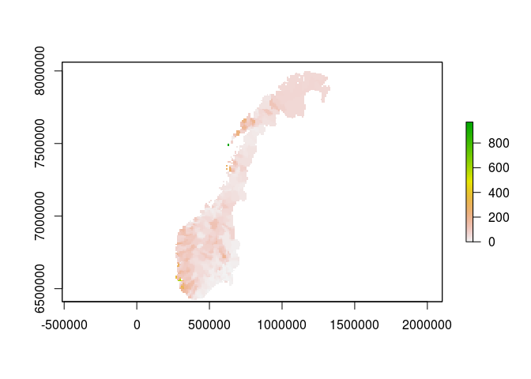
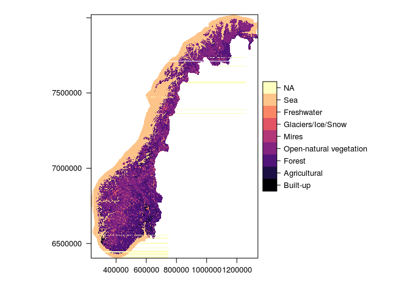
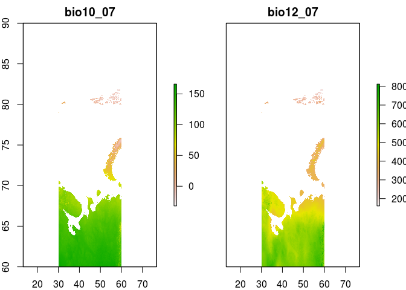
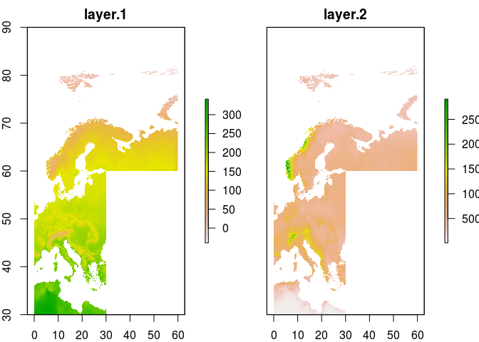
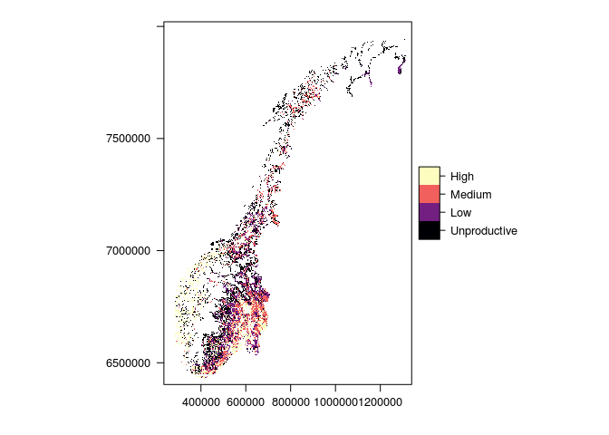
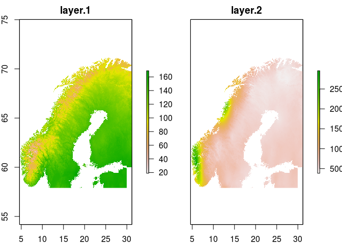
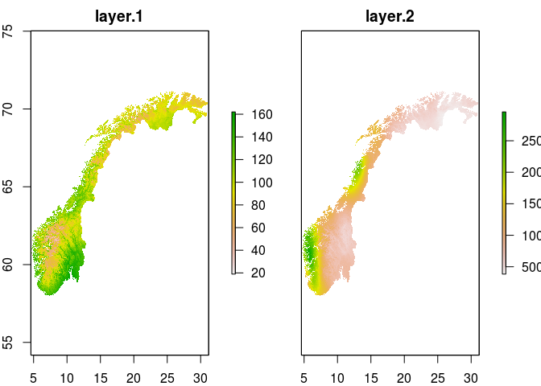
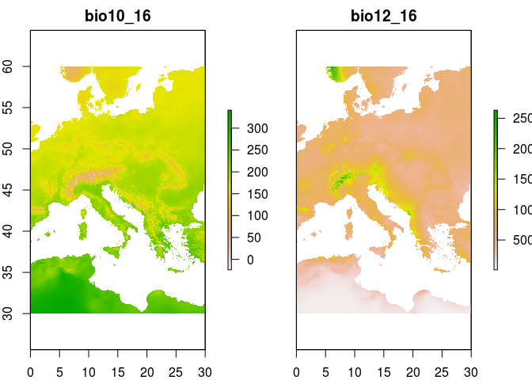

<!-- README.md is generated from README.Rmd. Please edit that file -->
sdmShiny
========

<!-- badges: start -->
<!-- badges: end -->
This project is for disseminating the species distribution modeling work done in James Speed's group at the NTNU University Museum. We will use web-based Shiny apps to present distribution maps of several species and allow these to change with the predictions of the SDM as the user tweaks the parameters for climate and herbivory. 

Installation
------------

Developers should clone the repo and work from there.One can also install the development version from [GitHub](https://github.com/) with:

``` r
install.packages("devtools")
devtools::install_github("anders-kolstad/sdmShiny")
```

Example application
-------------------

Follow this link <https://anderskolstad.shinyapps.io/demoSDM/>

Documentation
=============

This section explains the workflow that ended up the the shiny app. The r project is arranged as an r package. All r code such as functions are in the 'data' folder.

1) Get species list
-------------------

This is the first function. It produces a list of species that we will later use to harvest occurence data from gbif. ...

``` r
source("./R/spList.R")
mySpecies <- sl()
head(mySpecies)
#> [1] "Botrychium lanceolatum"  "Comastoma tenellum"     
#> [3] "Gentianella campestris"  "Kobresia simpliciuscula"
#> [5] "Primula scandinavica"    "Pseudorchis albida"

# alternatively
# mySpecies(df = TRUE)
```

Get environmental data (explanatory/independent variables)
==========================================================

From the alpine red listed species paper, I got this sent over from James:

``` r
IV <- raster::stack("data/large/selectvars.grd")
names(IV)
#> [1] "TundraHerbivores"  "MeanTempWarmQuart"
```

The first layer is the combined metabolic biomas of reindeer (wild and semi-domesticated) and sheep from the year 1999. I will use this later, but not the worldclim variable (see below).

``` r
#reindeerSheep <- IV[[1]]
#writeRaster(reindeerSheep, 'data/large/reindeerSheep')
reindeerSheep <- raster::stack('data/large/reindeerSheep.grd')
raster::plot(reindeerSheep)
```



From another of James' projects there is a file already collated with environmental data. It was downloaded from NTNU box: <https://ntnu.app.box.com/s/wcmr0dgoyz2yu6ielw6er1pm7h0gaisa/file/393633279036>

``` r
IV <- raster::stack("data/large/PredictorVariables.grd")
names(IV)[20:25]<-c('Elevation','Land_Cover','Forest_Type','Forest_Productivity','Vegetation_Type','SoilpH')
names(IV)
#>  [1] "bio1_16"             "bio2_16"             "bio3_16"            
#>  [4] "bio4_16"             "bio5_16"             "bio6_16"            
#>  [7] "bio7_16"             "bio8_16"             "bio9_16"            
#> [10] "bio10_16"            "bio11_16"            "bio12_16"           
#> [13] "bio13_16"            "bio14_16"            "bio15_16"           
#> [16] "bio16_16"            "bio17_16"            "bio18_16"           
#> [19] "bio19_16"            "Elevation"           "Land_Cover"         
#> [22] "Forest_Type"         "Forest_Productivity" "Vegetation_Type"    
#> [25] "SoilpH"              "moose1949"           "moose1959"          
#> [28] "moose1969"           "moose1979"           "moose1989"          
#> [31] "moose1999"           "moose2009"           "moose2015"          
#> [34] "red_deer1949"        "red_deer1959"        "red_deer1969"       
#> [37] "red_deer1979"        "red_deer1989"        "red_deer1999"       
#> [40] "red_deer2009"        "red_deer2015"        "roe_deer1949"       
#> [43] "roe_deer1959"        "roe_deer1969"        "roe_deer1979"       
#> [46] "roe_deer1989"        "roe_deer1999"        "roe_deer2009"       
#> [49] "roe_deer2015"
```

##### Description

-   This file does not contain reindeer, muskox, or livestock) densities.
-   ar50 maps are land use classes, including forest productivity (skogbon) and dominating forest tree species (treslag)
-   geonode is pH, but not actually, cause values range from 40-70 ish. But could be something like CEC perhaps?
-   bio1 to bio19 are worldclim variables. Only bio 10 and12 are used in the publications.

Worldclim was updated jan 2020, so I can get the bioclim variables again. This is a dataset of interpolated climate variables for the whole world at high resolution (0.5 arc minutes). It is build on data from 1970 onwards and so is not representing any one year. I need to download it as three tiles before merging these together. I will save each tile, but only the two variable bio10 and bio12, Mean Temperature of Warmest Quarter and Annual Precipitation, respectively.

``` r
# first tile
#Norbioclim<-getData('worldclim',var='bio',res=0.5,lon=5,lat=60) # approx 3 min
#Norbioclim <- Norbioclim[[c(10,12)]]
#writeRaster(Norbioclim,'data/large/Norbioclim')
Norbioclim <- raster::stack("data/large/Norbioclim.grd")
raster::plot(Norbioclim)
```



``` r
# second tile
#Norbioclim1<-getData('worldclim',var='bio',res=0.5,lon=5,lat=70)
#Norbioclim1 <- Norbioclim1[[c(10,12)]]
#writeRaster(Norbioclim1,'data/large/Norbioclim1')
Norbioclim1 <- raster::stack("data/large/Norbioclim1.grd")
raster::plot(Norbioclim1)
```



``` r
#third tile
#Norbioclim2<-getData('worldclim',var='bio',res=0.5,lon=40,lat=70)
#Norbioclim2 <- Norbioclim2[[c(10,12)]]
#writeRaster(Norbioclim2,'data/large/Norbioclim2')
Norbioclim2 <- raster::stack("data/large/Norbioclim2.grd")
raster::plot(Norbioclim2)
```



Then I merge these together.

``` r
mergclim<-raster::merge(Norbioclim,Norbioclim1)
mergclim1<-raster::merge(mergclim,Norbioclim2)
raster::plot(mergclim1)
```



Now I get a DTM for Norway to be used as an IV, but also to crop the wordclim data.

``` r
#Norelev<-getData('alt',country='NOR', res = 0.5) # 0.86 km2
#names(Norelev) # "NOR_msk_alt"
#writeRaster(Norelev, "data/large/Norelev") # 20mb
Norelev <- raster::stack("data/large/Norelev.grd")
raster::plot(Norelev)
```



Then I crop the worldclim data

``` r
cropclim<-raster::crop(mergclim1,Norelev)
raster::plot(cropclim)
```



That took care of the extent. Now I want to put all cells that are outside the DTM as NA also in the climate layers

``` r
Norclimdat<-raster::mask(cropclim,Norelev)
raster::plot(Norclimdat)
```



I can put these two together.

``` r
# NorClimElev<-stack(Norclimdat,Norelev)
# names(NorClimElev)<-c("temp", "prec", "elev")
# writeRaster(NorClimElev,'data/NorClimElev') # only 60 mb so shold be able to go on GitHub
NorClimElev <- raster::stack('data/NorClimElev.grd')
NorClimElev
#> class      : RasterStack 
#> dimensions : 1608, 3192, 5132736, 3  (nrow, ncol, ncell, nlayers)
#> resolution : 0.008333333, 0.008333333  (x, y)
#> extent     : 4.6, 31.2, 57.9, 71.3  (xmin, xmax, ymin, ymax)
#> crs        : +proj=longlat +datum=WGS84 +ellps=WGS84 +towgs84=0,0,0 
#> names      : temp, prec, elev 
#> min values :   11,  381,  -27 
#> max values :  164, 2958, 2292
```
