-   [sdmShiny](#sdmshiny)
    -   [Installation](#installation)
    -   [Example application](#example-application)
-   [Documentation](#documentation)
    -   [Environmental data](#environmental-data)
        -   [Overview](#overview)
        -   [Existing raster stacks](#existing-raster-stacks)
            -   [The 'alpine paper'](#the-alpine-paper)
            -   [The 'forest' paper](#the-forest-paper)
                -   [Ratify categorical layers](#ratify-categorical-layers)
                    -   [Land cover](#land-cover)
                    -   [Forest productivity](#forest-productivity)
                    -   [Forest type](#forest-type)
        -   [Worldclim data and DTM](#worldclim-data-and-dtm)
            -   [Combine all IVs](#combine-all-ivs)
    -   [Get species list](#get-species-list)
    -   [Occurence data](#occurence-data)
    -   [SDM](#sdm)
        -   [Variable importance](#variable-importance)
        -   [Ensemble](#ensemble)
        -   [Presence-absence map](#presence-absence-map)

<!-- README.md is generated from README.Rmd. Please edit that file -->
sdmShiny
========

<!-- badges: start -->
<!-- badges: end -->
Last update:

``` r
Sys.time()
#> [1] "2020-04-27 07:04:15 CEST"
```

This project is for disseminating the species distribution modeling work done in James Speed's group at the NTNU University Museum. We will use web-based Shiny apps to present distribution maps of several species and allow these to change with the predictions of the SDM as the user tweaks the parameters for climate and herbivory. The Shiny app will look something like this: 

Installation
------------

Developers should clone the repo and work from there.

Example application
-------------------

Follow this link <https://anderskolstad.shinyapps.io/demoSDM/>

Documentation
=============

This section explains the workflow that ended up the the shiny app. Large files around 100mb or greater, or unessential raster files etc., are in the data/large/ folder whihc is not pushed (it's in the .gitignore file) and therefore only exists locally with Anders. The same for RData files intill I find a way to load them without getting magic number errors (readRDS don't work with knitr).

Environmental data
------------------

### Overview

The alpine red-listed species paper used the following IVs, in the approximate order of importance:

-   bio10 (temperature)
-   bio12 (precipitation)
-   soil ph
-   Tundraherbivores - the combined metabolic biomass of sheep aand reindeer tundraherbivores
-   bio15 (precipitation seasonality)
-   AR50 categorical land-use classes (how many levels I don't know)

The 'forest paper' used these:

-   bio10
-   bio12
-   Forest type (three levels, from AR50)
-   soil pH
-   Cervid densities...

### Existing raster stacks

#### The 'alpine paper'

From the alpine red-listed species paper, I got this sent over from James:

``` r
IV <- raster::stack("data/large/selectvars.grd")
names(IV)
#> [1] "TundraHerbivores"  "MeanTempWarmQuart"
```

The first layer is the combined metabolic biomas of reindeer (wild and semi-domesticated) and sheep from the year 1999. I will use this later, but not the worldclim variable (see below). The resolution is 10km.

``` r
#reindeerSheep <- IV[[1]]
#writeRaster(reindeerSheep, 'data/large/reindeerSheep')
reindeerSheep <- raster::stack('data/large/reindeerSheep.grd')
rm(IV)
raster::plot(reindeerSheep)
```


#### The 'forest' paper

From another of James' projects there is a file already collated with environmental data. It was downloaded from NTNU box: <https://ntnu.app.box.com/s/wcmr0dgoyz2yu6ielw6er1pm7h0gaisa/file/393633279036>

``` r
PredVars <- raster::stack("data/large/PredictorVariables.grd")
names(PredVars)[20:25]<-c('Elevation','Land_Cover','Forest_Type','Forest_Productivity','Vegetation_Type','SoilpH')
names(PredVars)
#>  [1] "bio1_16"             "bio2_16"             "bio3_16"            
#>  [4] "bio4_16"             "bio5_16"             "bio6_16"            
#>  [7] "bio7_16"             "bio8_16"             "bio9_16"            
#> [10] "bio10_16"            "bio11_16"            "bio12_16"           
#> [13] "bio13_16"            "bio14_16"            "bio15_16"           
#> [16] "bio16_16"            "bio17_16"            "bio18_16"           
#> [19] "bio19_16"            "Elevation"           "Land_Cover"         
#> [22] "Forest_Type"         "Forest_Productivity" "Vegetation_Type"    
#> [25] "SoilpH"              "moose1949"           "moose1959"          
#> [28] "moose1969"           "moose1979"           "moose1989"          
#> [31] "moose1999"           "moose2009"           "moose2015"          
#> [34] "red_deer1949"        "red_deer1959"        "red_deer1969"       
#> [37] "red_deer1979"        "red_deer1989"        "red_deer1999"       
#> [40] "red_deer2009"        "red_deer2015"        "roe_deer1949"       
#> [43] "roe_deer1959"        "roe_deer1969"        "roe_deer1979"       
#> [46] "roe_deer1989"        "roe_deer1999"        "roe_deer2009"       
#> [49] "roe_deer2015"
```

Info

-   This file does not contain reindeer, muskox, or livestock densities.
-   ar50 maps are land use classes, including forest productivity (skogbon) and dominating forest tree species (treslag)
-   bio1 to bio19 are worldclim variables. Only bio 10 and12 are used in the publication (bio15 is used in the 'alpine paper').
-   resolution is 1km
-   geonode is soil pH (soilgrids.org). The units are ph \* 10.

``` r
PredVars$SoilpH <- PredVars$SoilpH/10
```

##### Ratify categorical layers

I need to convert some layers from continous to categorial.

###### Land cover

``` r
PredVars$Land_Cover <- raster::ratify(PredVars$Land_Cover) # essentially just as.factor(x)
ratlc               <- raster::levels(PredVars$Land_Cover)[[1]]
ratlc$Land_Cover <- c("Built-up",
                                    "Agricultural",
                                    "Forest",
                                    "Open-natural vegetation",
                                    "Mires",
                                    "Glaciers/Ice/Snow",
                                    "Freshwater",
                                    "Sea",
                                    "NA")
levels(PredVars$Land_Cover) <- ratlc
rasterVis::levelplot(PredVars$Land_Cover)
```


###### Forest productivity

``` r
raster::levels(raster::ratify(PredVars$Forest_Productivity))
#> [[1]]
#>   ID
#> 1 11
#> 2 12
#> 3 13
#> 4 18
#> 5 98
#> 6 99
```

We don't want levels 98 and 99. Class 99 = 'ikke registrert'.

``` r
PredVars$Forest_Productivity[PredVars$Forest_Productivity>18]<-NA
PredVars$Forest_Productivity <- 
  raster::ratify(PredVars$Forest_Productivity)

ratlcp <- raster::levels(PredVars$Forest_Productivity)[[1]]
ratlcp[['Forest_Productivity']] <- 
  c('Unproductive',
    'Low',
    'Medium',
    'High')

levels(PredVars$Forest_Productivity) <- ratlcp
rasterVis::levelplot(PredVars$Forest_Productivity)
```

 Ares of NA where there's no forest.

###### Forest type

``` r
raster::levels(raster::ratify(PredVars$Forest_Type))
#> [[1]]
#>   ID
#> 1 31
#> 2 32
#> 3 33
#> 4 39
#> 5 98
#> 6 99
```

Deleting class 98 and 99 as above, but also 39 although I', not sure what that is...

``` r
PredVars$Forest_Type[PredVars$Forest_Type>33]<-NA
PredVars$Forest_Type<-raster::ratify(PredVars$Forest_Type)
ratlct<-raster::levels(PredVars$Forest_Type)[[1]]
ratlct[['ForestType']] <-
  c('Coniferous','Deciduous','Mixed')
levels(PredVars$Forest_Type) <- ratlct
rasterVis::levelplot(PredVars$Forest_Type)
```

 Subset and keep only the layers we'll need.

``` r
PredVars <- PredVars[[c(21:23, 25, 31, 39, 47)]]
names(PredVars)
#> [1] "Land_Cover"          "Forest_Type"         "Forest_Productivity"
#> [4] "SoilpH"              "moose1999"           "red_deer1999"       
#> [7] "roe_deer1999"
```

Let's look at the other ones as well.

``` r
par(mfrow = c(2,2))
raster::plot(PredVars$SoilpH, main = "Soil pH")
raster::plot(PredVars$moose1999, main = "Moose")
raster::plot(PredVars$red_deer1999, main = "Red deer")
raster::plot(PredVars$roe_deer1999, main = "Roe deer")
```

 Reset par

``` r
par(mfrow = c(1,1))
```

Land cover and soil pH need some fixing. We can use any of the cervid data to mask them I think.

``` r
PredVars$SoilpH <- raster::mask(PredVars$SoilpH, PredVars$roe_deer1999)
raster::plot(PredVars$SoilpH)
```

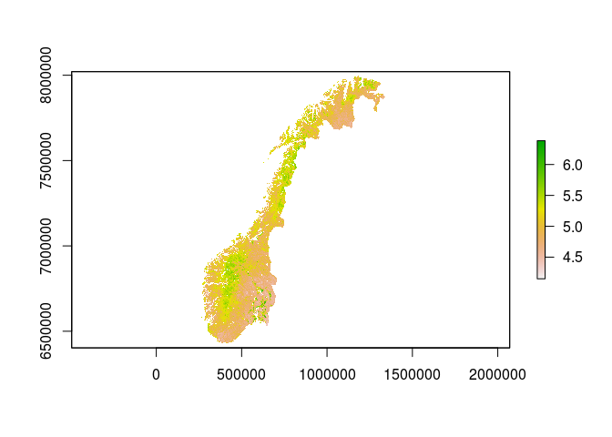 Better. And now land cover.

``` r
PredVars$Land_Cover <- raster::mask(PredVars$Land_Cover, PredVars$roe_deer1999)
rasterVis::levelplot(PredVars$Land_Cover)
```

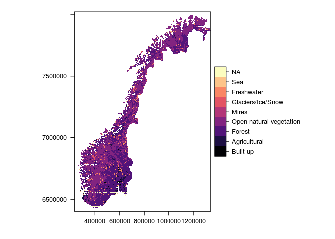 Colours are terrible, but it's motly forest and open natural vegetation, with some lines of NA's cutting across. Should be fine.

### Worldclim data and DTM

Worldclim was updated jan 2020, so I can get the bioclim variables again. This is a dataset of interpolated climate variables for the whole world at high resolution (0.5 arc minutes). It is build on data from 1970 onwards and so is not representing any one year. I need to download it as three tiles before merging these together. I will save each tile, but only the two variable bio10 and bio12, Mean Temperature of Warmest Quarter and Annual Precipitation, respectively. First, let's delete the old bioclim variables, and also the cervid density data for all years exept the one we're going to use, which is 1999 (closest to the mean data of the species occurence records).

``` r
# first tile
#Norbioclim<-getData('worldclim',var='bio',res=0.5,lon=5,lat=60) # approx 3 min
#Norbioclim <- Norbioclim[[c(10,12)]]
#writeRaster(Norbioclim,'data/large/Norbioclim')
Norbioclim <- raster::stack("data/large/Norbioclim.grd")
raster::plot(Norbioclim)
```

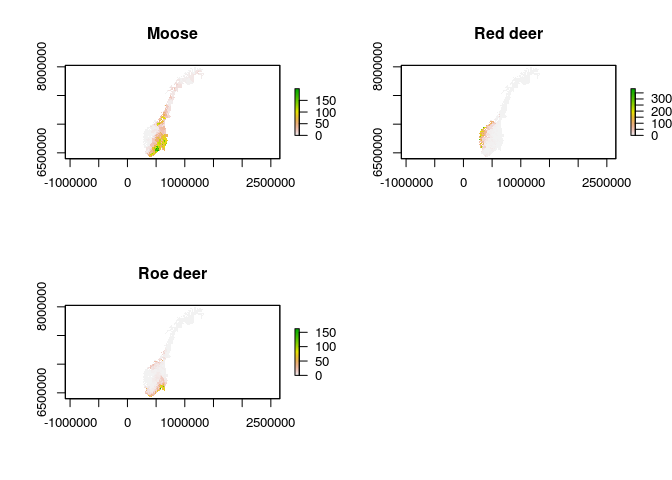

``` r
# second tile
#Norbioclim1<-getData('worldclim',var='bio',res=0.5,lon=5,lat=70)
#Norbioclim1 <- Norbioclim1[[c(10,12)]]
#writeRaster(Norbioclim1,'data/large/Norbioclim1')
Norbioclim1 <- raster::stack("data/large/Norbioclim1.grd")
raster::plot(Norbioclim1)
```

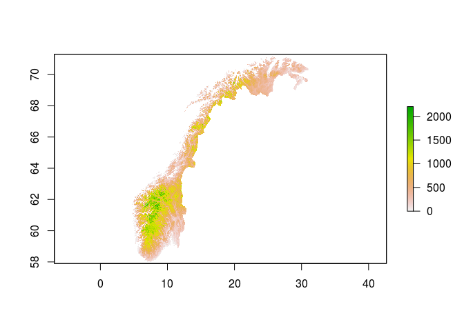

``` r
#third tile
#Norbioclim2<-getData('worldclim',var='bio',res=0.5,lon=40,lat=70)
#Norbioclim2 <- Norbioclim2[[c(10,12)]]
#writeRaster(Norbioclim2,'data/large/Norbioclim2')
Norbioclim2 <- raster::stack("data/large/Norbioclim2.grd")
raster::plot(Norbioclim2)
```

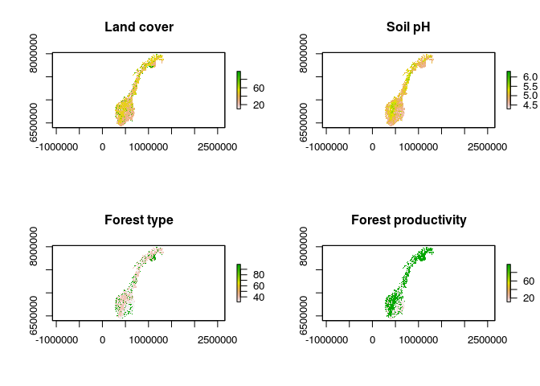

Then I merge these together.

``` r
mergclim<-raster::merge(Norbioclim,Norbioclim1)
mergclim1<-raster::merge(mergclim,Norbioclim2)
raster::plot(mergclim1)
```


Now I get a DTM for Norway to be used as an IV, but also to crop the wordclim data.

``` r
#Norelev<-getData('alt',country='NOR', res = 0.5) # 0.86 km2
#names(Norelev) # "NOR_msk_alt"
#writeRaster(Norelev, "data/large/Norelev") # 20mb
Norelev <- raster::stack("data/large/Norelev.grd")
raster::plot(Norelev)
```


Then I crop the worldclim data

``` r
cropclim<-raster::crop(mergclim1,Norelev)
raster::plot(cropclim)
```


That took care of the extent. Now I want to put all cells that are outside the DTM as NA also in the climate layers

``` r
Norclimdat<-raster::mask(cropclim,Norelev)
raster::plot(Norclimdat)
```

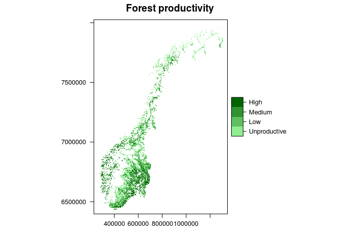

I can put these two together.

``` r
# NorClimElev<-stack(Norclimdat,Norelev)
# names(NorClimElev)<-c("temp", "prec", "elev")
# writeRaster(NorClimElev,'data/NorClimElev') # only 60 mb so shold be able to go on GitHub
NorClimElev <- raster::stack('data/NorClimElev.grd')
NorClimElev
#> class      : RasterStack 
#> dimensions : 1608, 3192, 5132736, 3  (nrow, ncol, ncell, nlayers)
#> resolution : 0.008333333, 0.008333333  (x, y)
#> extent     : 4.6, 31.2, 57.9, 71.3  (xmin, xmax, ymin, ymax)
#> crs        : +proj=longlat +datum=WGS84 +ellps=WGS84 +towgs84=0,0,0 
#> names      : temp, prec, elev 
#> min values :   11,  381,  -27 
#> max values :  164, 2958, 2292
```

#### Combine all IVs

Now I can get all the IV layers on the same projection and stack them in a single file.

``` r
names(PredVars)
PredVars@crs       # +proj=utm +zone=32 +ellps=GRS80 +units=m +no_defs 
reindeerSheep@crs  # +proj=utm +zone=32 +datum=WGS84 +units=m +no_defs +ellps=WGS84 +towgs84=0,0,0 
NorClimElev@crs    # +proj=longlat +datum=WGS84 +ellps=WGS84 +towgs84=0,0,0 
```

I'm going to use UTM32 projection because the maps look better (more familiar) than with latlon. For the worldclim data and the reindeerSheep data there will also be a resampling. I'm also going to delete some layers I don't need and save it all as IV (overwriting previous name).

``` r
newproj <- "+proj=utm +zone=32 +datum=WGS84 +units=m +no_defs +ellps=WGS84 +towgs84=0,0,0"
PredVars2          <- raster::projectRaster(PredVars, crs = newproj, method='bilinear')
reindeerSheep2     <- raster::projectRaster(reindeerSheep, PredVars2[[1]], method='bilinear')
NorClimElev2       <- raster::projectRaster(NorClimElev, PredVars2[[1]], method='bilinear')
IV                 <- raster::stack(PredVars2, reindeerSheep2, NorClimElev2)
# writeRaster(IV, 'data/IV', overwrite=TRUE) # 76 MB
myIVs              <- raster:: stack('data/IV.grd')
names(myIVs)
#>  [1] "Land_Cover"          "Forest_Type"         "Forest_Productivity"
#>  [4] "SoilpH"              "moose1999"           "red_deer1999"       
#>  [7] "roe_deer1999"        "TundraHerbivores"    "temp"               
#> [10] "prec"                "elev"
```

Get species list
----------------

This function produces a list of species that we will later use to harvest occurence data from gbif. More on this later.

``` r
source("./R/spList.R")
mySpecies <- sl()
head(mySpecies)
#> [1] "Botrychium lanceolatum"  "Comastoma tenellum"     
#> [3] "Gentianella campestris"  "Kobresia simpliciuscula"
#> [5] "Primula scandinavica"    "Pseudorchis albida"

# alternatively
# mySpecies(df = TRUE)
```

Occurence data
--------------

To get occurence data I will use the gbif function in the dismo package. It can only handle one species at the time, so I will need to make a for-loop.

``` r
head(mySpecies)
#> [1] "Botrychium lanceolatum"  "Comastoma tenellum"     
#> [3] "Gentianella campestris"  "Kobresia simpliciuscula"
#> [5] "Primula scandinavica"    "Pseudorchis albida"
```

This is my species list with correct spelling (direct from ADB).

To test the functions I will use a shorter list of 10 species.

``` r
mySpecies2 <- mySpecies[1:10]
```

Lets do a test loop without downloading anything, just seeing how many records there are.

``` r
nOccurences_df <- data.frame(species = mySpecies2, 
                  nOccurences = as.numeric(NA))

for(i in 1:length(mySpecies2)){
  myName  <- mySpecies2[i]
  myName2 <- stringr::str_split(myName, " ")[[1]]
  nOccurences_df$nOccurences[i] <- dismo::gbif(myName2[1], myName2[2], download = F) 
}
#> Loading required namespace: jsonlite

nOccurences_df
#>                    species nOccurences
#> 1   Botrychium lanceolatum        4980
#> 2       Comastoma tenellum        6321
#> 3   Gentianella campestris       53393
#> 4  Kobresia simpliciuscula        3393
#> 5     Primula scandinavica         321
#> 6       Pseudorchis albida       20971
#> 7      Pulsatilla vernalis       23674
#> 8    Buglossoides arvensis       42231
#> 9       Anisantha sterilis      113405
#> 10       Sorbus lancifolia         101
```

This shows some of the bas in the occurence data. For example that B arvensis, a super rare plant found almost only on Hovedøya, an island outside of Oslo, has 37k records, whereas P. scandinavica, a relatively common plant, has 321.

For the next part I will use two species with a quite low number of records to reduce processing time.

``` r
mySpecies3 <- mySpecies[mySpecies == c("Primula scandinavica", "Kobresia simpliciuscula")]
```

For fun. lets see what these plants look like.

``` r
list.files("./figures/plants")
```

 Picture: *Kobresia simpliciuscula* (Andrey Zharkikh CC-BY 2.0)

 Picture: *Primula scandinavica* (Anders Kolstad CC-BY 4.0)

(Note: The picture sizes are 250p and 400p, respectively)

For real this time:

``` r
for(i in 1:length(mySpecies3)){
  myName  <- mySpecies3[i]
  myName2 <- stringr::str_split(myName, " ")[[1]]
  
  assign(
    sub(' ', '_', mySpecies3[i]), 
         dismo::gbif(myName2[1], myName2[2], 
                                        download = T,
                                        geo = T, 
                                        sp = F) 
  )
}
#> 3393 records found
#> 0-300-600-900-1200-1500-1800-2100-2400-2700-3000-3300-3393 records downloaded
#> 321 records found
#> 0-300-321 records downloaded
```

Two new dataframes are put in the environment. They have a lot of columns to start with, so lets get rid of som to make the objects smaller. I only need the species names and the coordinates (perhaps some more, but I can add those later).

``` r
qc <- data.frame(Species = mySpecies3,
                 lon_is_NA =                        as.numeric(NA),
                 lat_NA_when_lon_not          =     as.numeric(NA),
                 lon_is_zero =                      as.numeric(NA),
                 lat_zero_when_lon_not = as.numeric(NA))

for(i in 1:length(mySpecies3)){
  
  
  d <- get(
           sub(' ', '_', mySpecies3[i]))
  d <- d[,c("species","lat","lon")]
  
  # remove spaces in names (it clogs up the sdm function)
  d$species <- sub(' ', '_', d$species)
  
  # remove NA's
  w1 <- which(is.na(d$lon))
  if(length(w1) != 0) d <- d[-w1,]
  w2 <- which(is.na(d$lat))
  if(length(w2) != 0) d <- d[-w2,]
  
  # remove those with coordinates equal to zero
  w3 <- which(d$lon == 0)
  if(length(w3) != 0) d <- d[-w3,]
  w4 <- which(d$lat == 0)
  if(length(w4) != 0) d <- d[-w4,]
  
  assign(
      sub(' ', '_', mySpecies3[i]),  d)
  
  qc[i,2] <- length(w1)
  qc[i,3] <- length(w2)
  qc[i,4] <- length(w3)
  qc[i,5] <- length(w4)
  
}
```

A dataframe called qc tells us what has happened.

``` r
qc
#>                   Species lon_is_NA lat_NA_when_lon_not lon_is_zero
#> 1 Kobresia simpliciuscula       787                   0           0
#> 2    Primula scandinavica       172                   0           0
#>   lat_zero_when_lon_not
#> 1                     0
#> 2                     0
```

We have cut 787 rows from the Kobresia and 172 from Primula, due to missing coordinates.

Now we can turn the dataframes into spatialPointsDataFrames, define the CRS, and plot the points. The dataset comes as lonlat.

``` r
for(i in 1:length(mySpecies3)){
  
  d <- get(
           sub(' ', '_', mySpecies3[i]))
  
  sp::coordinates(d) <- ~lon + lat
  sp::proj4string(d) <- sp::proj4string(raster::raster())
  
  assign(
      sub(' ', '_', mySpecies3[i]),  d)
}
```

``` r
mapview::mapview(Kobresia_simpliciuscula, 
                 map.types = c("Esri.WorldShadedRelief",
                               "Esri.WorldImagery"),
                 cex = 5, lwd = 0,
                 alpha.regions = 0.5,
                 col.regions = "blue")
```

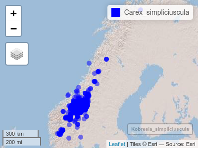

``` r
mapview::mapview(Primula_scandinavica, 
                 map.types = c("Esri.WorldShadedRelief",
                               "Esri.WorldImagery"),
                 cex = 5, lwd = 0,
                 alpha.regions = 0.5,
                 col.regions = "blue")
```

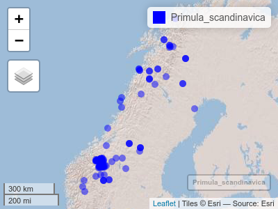 First, notice that Kobresia is called Carex in GBIF, but Kobresia in ADB. This is not a problem and they are recognised as synonyms. The Kobresia is a widespread species, whereas the Primula is endemic to Norway and Sweden. We only need the point that fall on Norway. First we need something to clip against, so we'll get an outline of Norway.

``` r
# outline <- norway()
#saveRDS(outline, "data/large/outline_Norway.RData") # 1.8MB
outline <- readRDS("data/large/outline_Norway.RData")
raster::plot(outline)
```

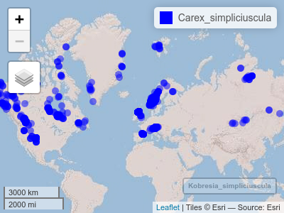

Now to clip away occurences outside this polygon (can take a few minutes)

``` r

for(i in 1:length(mySpecies3)){
  
  d <- get(
           sub(' ', '_', mySpecies3[i]))
  
  d <- raster::crop(d, outline)
  
  assign(
      sub(' ', '_', mySpecies3[i]),  d)
}
```

Let's see it it worked.

``` r
mapview::mapview(Kobresia_simpliciuscula, 
                 map.types = c("Esri.WorldShadedRelief",
                               "Esri.WorldImagery"),
                 cex = 5, lwd = 0,
                 alpha.regions = 0.5,
                 col.regions = "blue")
```


``` r
mapview::mapview(Primula_scandinavica, 
                 map.types = c("Esri.WorldShadedRelief",
                               "Esri.WorldImagery"),
                 cex = 5, lwd = 0,
                 alpha.regions = 0.5,
                 col.regions = "blue")
```

 Looks like it. Now we just need to get this over to UTM32 to match the IV data, and save it on file.

``` r
for(i in 1:length(mySpecies3)){
  
  d <- get(
           sub(' ', '_', mySpecies3[i]))
  
  d <- sp::spTransform(d, myIVs[[1]]@crs)
  
  assign(
      sub(' ', '_', mySpecies3[i]),  d)
}

oDat <- get(sub(' ', '_', mySpecies3[1]))
for(i in 2:length(mySpecies3)){
  oDat <- rbind(oDat, get(sub(' ', '_', mySpecies3[i])))
  }
saveRDS(oDat, 'data/large/oDat.RData')
rm(oDat)
```

``` r
oDat <- readRDS('data/large/oDat.RData')
```

``` r
raster::plot(myIVs[[10]])
raster::plot(oDat,add=T)
```

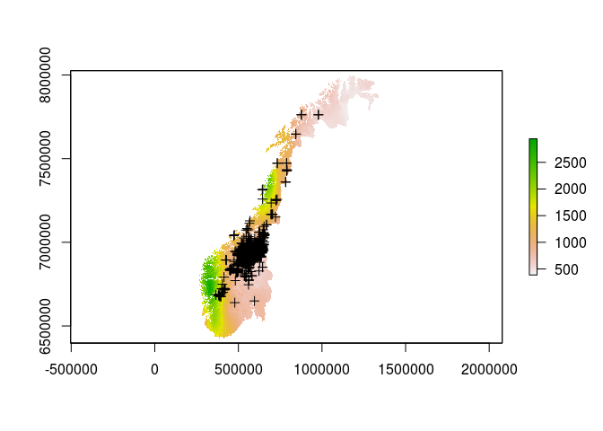

SDM
---

Now we have all we need to make a model. We can then save the model object and use it for making predictions live in the application. The two test species are alpine red listed plants, so I'll use the IV from the alpine paper. Actually, I'll skipp the two least important variables land\_use\_classes and bio15. I'll create 1000 random pseudo absences across the goegraphical area (Norway I suppose). To avoid struggling too much with subsetting these strange sdm objects, I will run one set of models for each species, although I know that in sdm::sdm you can specify smultiple species.

``` r
library(sdm)
#> Loading required package: sp
#> sdm 1.0-82 (2020-02-03)
```

``` r
library(sdm)
for(i in 1:length(mySpecies3)){
  s    <- unique(oDat$species)[i]
  s2   <- paste0(s, "_d")
  d    <- oDat[oDat$species == s,]
  dat  <- sdm::sdmData(species~temp+prec+SoilpH+TundraHerbivores,
                   train = d,
                   predictors = myIVs,
                   bg = list(n=nrow(d), method = "gRandom"))
  
  # assign(s2, dat)
  sdm::write.sdm(dat, paste0("models/sdmData/", s2), overwrite=TRUE)
}
```

This takes the names over to the gbif approved names (Kobresia to Carex). Perhaps it's for the best. (Hmm, no, that'll make it more difficult to find the model object in the folders when there are tens of models. )

This code could bring the sdmData back in into the environment, but I don't need it now:

``` r
for(i in 1:length(mySpecies3)){
  s    <- unique(oDat$species)[i]
  s2   <- paste0(s, "_d")
  s3   <- paste0("models/sdmData/", s, "_d.sdd")
  assign(s2, sdm::read.sdm(s3))
}
```

We don't have any independent test data so I'll use bootstrapping to partition test data, and I'll do that 5 times. I shouldn't do much less becaus ethere are very few data points for some of the species, like P scandinavica. Esp. since records from inside the same 1km cells will be counted as duplicates and removed. I will use 3 methods as well, resulting in 3\*5 = 15 models per species. It takes about 1-2 min to run this.

``` r
for(i in 1:length(mySpecies3)){
  
  s       <- unique(oDat$species)[i]
  file1   <- paste0("models/sdmData/", s, "_d.sdd")
  obj     <- paste0(s, "_m")
  file2   <- paste0("models/sdmModels/", obj)
  d      <- sdm::read.sdm(file1)
  
  mod <- sdm::sdm(.~.,
              data = d, 
              methods = c('glm', 'gam', 'rf'),   
              replication = c('boot'), n=5)     
  
  sdm::write.sdm(mod, file2, overwrite=TRUE)
  
}
```

*Technical note: I seems to not be possible to print characters inside the sdm function formula, and therefore we neede seperate sdmData files for each species. I.e. the following fails.*

``` r
for(i in 1:length(mySpecies3)){
  s <- unique(oDat$species)[i]
  d <- get(paste0(s, "_d"))
  mod <- sdm::sdm(paste(s)~.,     # also tried noquote, eval, and  print(quote = F)...
              data = d, 
              methods = c('glm', 'gam', 'rf'),   
              replication = c('boot'), n=3)
    assign(paste0(s, "_mxxx"), 
         mod)
}
```

I get some warning about the number of unique data points being five or less: *"Iteration limit reached without full convergence - check carefullyThe response has five or fewer unique values. Are you sure you want to do regression?"* But the models ran at least. Lets bring them back in to the environment. They're 3-20 20 MB each on file, or 17-55 when unzipped in the environment.

``` r
for(i in 1:length(mySpecies3)){
  s      <- unique(oDat$species)[i]
  s2     <- paste0(s, "_m")
  file   <- paste0("models/sdmModels/", s2, ".sdm")
  
  assign(s2, sdm::read.sdm(file))
}
```

``` r
Carex_simpliciuscula_m
#> Loading required package: dismo
#> Loading required package: raster
#> Loading required package: gbm
#> Loaded gbm 2.1.5
#> Loading required package: tree
#> Registered S3 method overwritten by 'tree':
#>   method     from
#>   print.tree cli
#> Loading required package: mda
#> Loading required package: class
#> Loaded mda 0.4-10
#> Loading required package: mgcv
#> Loading required package: nlme
#> 
#> Attaching package: 'nlme'
#> The following object is masked from 'package:raster':
#> 
#>     getData
#> This is mgcv 1.8-28. For overview type 'help("mgcv-package")'.
#> Loading required package: glmnet
#> Loading required package: Matrix
#> Loaded glmnet 3.0-2
#> Loading required package: earth
#> Loading required package: Formula
#> Loading required package: plotmo
#> Loading required package: plotrix
#> Loading required package: TeachingDemos
#> Loading required package: rJava
#> Loading required package: RSNNS
#> Loading required package: Rcpp
#> Loading required package: randomForest
#> randomForest 4.6-14
#> Type rfNews() to see new features/changes/bug fixes.
#> Loading required package: rpart
#> Loading required package: kernlab
#> 
#> Attaching package: 'kernlab'
#> The following objects are masked from 'package:raster':
#> 
#>     buffer, rotated
#> class                                 : sdmModels 
#> ======================================================== 
#> number of species                     :  1 
#> number of modelling methods           :  3 
#> names of modelling methods            :  glm, gam, rf 
#> replicate.methods (data partitioning) :  bootstrap 
#> number of replicates (each method)    :  5 
#> toral number of replicates per model  :  5 (per species) 
#> ------------------------------------------
#> model run success percentage (per species)  :
#> ------------------------------------------
#> method          Carex_simpliciuscula     
#> ------------------------------ 
#> glm        :            100   %
#> gam        :            100   %
#> rf         :            100   %
#> 
#> ###################################################################
#> model Mean performance (per species), using test dataset (generated using partitioning):
#> -------------------------------------------------------------------------------
#> 
#>  ## species   :  Carex_simpliciuscula 
#> =========================
#> 
#> methods    :     AUC     |     COR     |     TSS     |     Deviance 
#> -------------------------------------------------------------------------
#> glm        :     0.91    |     0.76    |     0.75    |     0.71     
#> gam        :     0.9     |     0.76    |     0.73    |     0.91     
#> rf         :     0.97    |     0.88    |     0.89    |     0.43
```

``` r
Primula_scandinavica_m
#> class                                 : sdmModels 
#> ======================================================== 
#> number of species                     :  1 
#> number of modelling methods           :  3 
#> names of modelling methods            :  glm, gam, rf 
#> replicate.methods (data partitioning) :  bootstrap 
#> number of replicates (each method)    :  5 
#> toral number of replicates per model  :  5 (per species) 
#> ------------------------------------------
#> model run success percentage (per species)  :
#> ------------------------------------------
#> method          Primula_scandinavica     
#> ------------------------------ 
#> glm        :            100   %
#> gam        :            20   %
#> rf         :            100   %
#> 
#> ###################################################################
#> model Mean performance (per species), using test dataset (generated using partitioning):
#> -------------------------------------------------------------------------------
#> 
#>  ## species   :  Primula_scandinavica 
#> =========================
#> 
#> methods    :     AUC     |     COR     |     TSS     |     Deviance 
#> -------------------------------------------------------------------------
#> glm        :     0.9     |     0.76    |     0.85    |     4.05     
#> gam        :     0.89    |     0.78    |     0.75    |     5.69     
#> rf         :     0.96    |     0.87    |     0.94    |     0.46
```

The gams didn't too to well. Only one out of five converged.

### Variable importance

I would also like to get a plot of the combined/averaged variable importance.

``` r
# create empty list
varimp <- list()

# list of IVs (different for alpine and forest species). 
# Make sure to put them in the correct order. 
# Find the order with > getVarImp(yourModel, id = 1)@varImportance
IV <- c("temp", "prec", "SoilpH", "TundraHerbivores")

# Create an empty varimp table
df1 <- data.frame(variables = IV,
                  corTest = as.numeric(NA),
                  AUCtest = as.numeric(NA))
                  
for(i in 1:length(mySpecies3)){
  s      <- unique(oDat$species)[i]
  s2     <- paste0(s, "_m")
  d      <- get(s2)
  tab    <- d@run.info

for(t in 1:max(tab$modelID)){
  r <- length(varimp)+1
  ifelse(tab$success[t]==TRUE,
           varimp[[r]]          <-sdm::getVarImp(d,id=t)@varImportance,
           varimp[[r]]          <- df1)
         
           varimp[[r]]$species  <-tab$species[t]
           varimp[[r]]$method   <-tab$method[t]
           varimp[[r]]$repid    <-tab$replicationID[t]      
         
   #if(tab$success[t]==FALSE) return(print(paste('Model failiure run ',t)))
}
}

varimp<-do.call('rbind',varimp)
rm(s, s2, d, tab, df1)
source("R/se.R")
varimpmean <- aggregate(data = varimp,
                        corTest ~ species + variables,
                        FUN = function(x) c(mean = mean(x, na.rm=T), se = se(x)))
varimpmean <- do.call(data.frame, varimpmean)
head(varimpmean)
#>                species variables corTest.mean  corTest.se
#> 1 Carex_simpliciuscula      prec   0.33632000 0.018987174
#> 2 Primula_scandinavica      prec   0.10008182 0.036686774
#> 3 Carex_simpliciuscula    SoilpH   0.04399333 0.008732727
#> 4 Primula_scandinavica    SoilpH   0.31303636 0.074824753
#> 5 Carex_simpliciuscula      temp   0.44743333 0.025987178
#> 6 Primula_scandinavica      temp   0.39357273 0.071323466
```

Changing the variable nems for axis tick labels

``` r
varimpmean$variables <- plyr::revalue(varimpmean$variables, c(
              prec         = "Årlig nedbørsmengde\n
                              Annual precipitation",
              SoilpH       = "pH i jorden\nSoil pH",
              temp         = "Gjennomsnittemperatur i varmeste kvartal\n
                              Mean temperature in warmenst quarter",
              TundraHerbivores = "Tetthet av sau og reinsdyr\n
                                  Sheep and reindeer densities"))
```

We can make one plot per species and show it in the app. That way the user will know what slider should induce the biggest effect.

``` r
library(ggplot2)

for(i in 1:length(unique(varimpmean$species))){
  
  d <- varimpmean[varimpmean$species==unique(varimpmean$species)[i],]
  s <- paste0("./models/varimp/",
              unique(varimpmean$species)[i],
              ".png")
  
  p <- ggplot2::ggplot(data = d)+
  geom_bar(aes(y = corTest.mean, 
               x = variables, 
               fill = variables), 
           stat = "identity", 
           colour = "black")+
  coord_flip()+
  ylab("Variabelviktigheten\nVariable importance")+
  xlab("")+
  theme_minimal()+
  theme(axis.text.y = element_text(size = 10))+
  theme(legend.position="none")+
  geom_errorbar(aes(x = variables, ymin=corTest.mean-corTest.se, ymax=corTest.mean+corTest.se), width=.2)

  png(filename = s,
    width = 380, height = 380, units = "px")
  print(p)
  dev.off()
}
```

 

### Ensemble

Lets put the 5\*3 models together and make a map of the current habitat suitability, using ensamble. Runtime approx. 1 min.

``` r
for(i in 1:length(mySpecies3)){
  s <- unique(oDat$species)[i]
  d <- get(paste0(s, "_m"))
  
  mod <- sdm::ensemble(d,
              newdata = myIVs, 
              filename = paste0("models/predictions/", s, "_ens"),   
              setting = list(method='weighted', stat = 'AUC'),
              overwrite=TRUE)     
  assign(paste0(s, "_ens"), 
         mod)
}
```

Lets plot them.

``` r
Primula_scandinavica_ens <- raster::raster("models/predictions/Primula_scandinavica_ens.grd")
raster::plot(Primula_scandinavica_ens, main = "Habitat suitability for Primula scandinavica")
raster::plot(oDat[oDat$species == "Primula_scandinavica",], add=T, cex = 0.2)
```

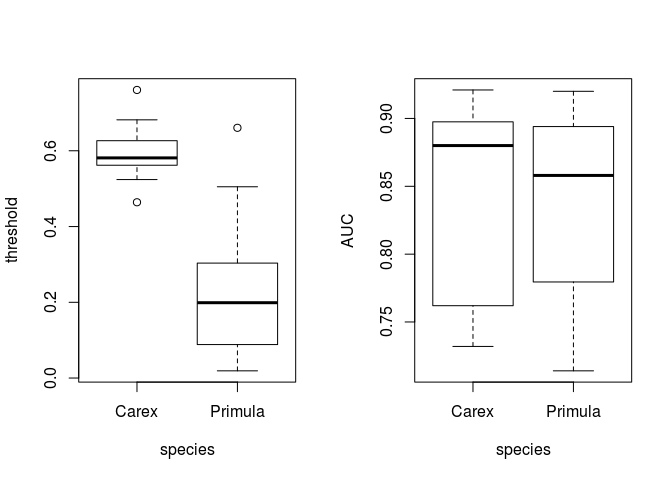 The realised nishe is considerably smaller then the desirable or fundamental nishe.

``` r
Carex_simpliciuscula_ens <- raster::raster("models/predictions/Carex_simpliciuscula_ens.grd")
raster::plot(Carex_simpliciuscula_ens, main = "Habitat suitability for Carex simpliciuscula")
raster::plot(oDat[oDat$species == "Carex_simpliciuscula",], add=T, cex = 0.2)
```

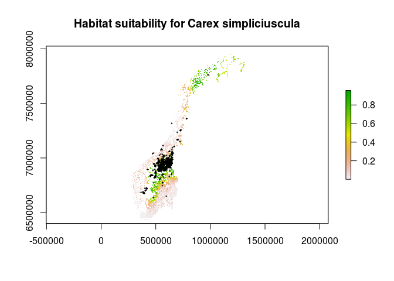 There are some white spots on the maps, the same areas for both. I need to figure out why....

For most people I think presence-absence is more understandable than probability of occurence. Let's use mean threshold value for defining p-a and plot a discrete map instead.

### Presence-absence map

``` r
for(i in 1:length(mySpecies3)){
  s <- as.name(paste0(unique(oDat$species)[i], "_m"))
  ev <- paste0(unique(oDat$species)[i], "_ev")
  assign(ev, sdm::getEvaluation(eval(s), 
                   stat = c('AUC', 'threshold'))
  )
}
```

``` r
for(i in 1:length(mySpecies3)){
  ens    <- get(paste0(unique(oDat$species)[i], "_ens"))
  ev     <- get(paste0(unique(oDat$species)[i], "_ev"))
  s      <- paste0(unique(oDat$species)[i], "_pa")
  
  
  ens[]   <- ifelse(ens[] >= mean(ev$threshold), 1, 0)
  assign(s, ens)
}
```

``` r
Primula_scandinavica_pa2 <- raster::ratify(Primula_scandinavica_pa)
lev <- raster::levels(Primula_scandinavica_pa2)[[1]] 
lev$pa <- c("Absent", "Present")
levels(Primula_scandinavica_pa2) <- lev
source("R/norway.R")
nor <- norway(lonlat = FALSE)
library(latticeExtra)
#> Loading required package: lattice
rasterVis::levelplot(Primula_scandinavica_pa2, 
                   margin=F,
                   main="Primula scandinavica",
                   scales=list(draw=F),
                   col.regions= c("grey", "blue"))+
  layer(sp::sp.polygons(nor),col=grey(0.5))
```

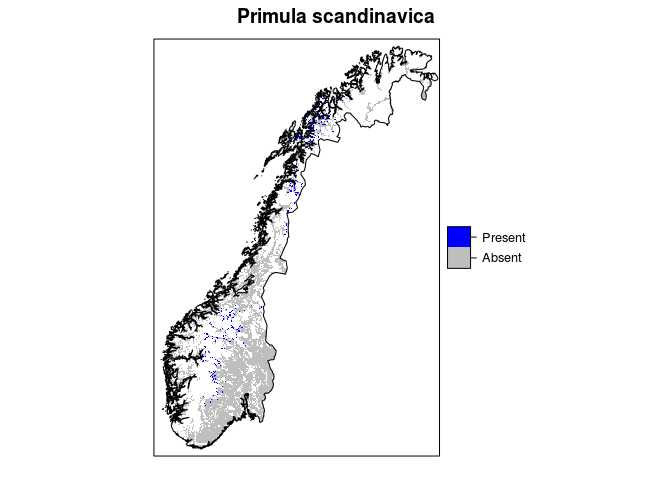 There are areas in white which there is no class and I'm not sure why...

``` r
Carex_simpliciuscula_pa2 <- raster::ratify(Carex_simpliciuscula_pa)
lev <- raster::levels(Carex_simpliciuscula_pa2)[[1]] 
lev$pa <- c("Absent", "Present")
levels(Carex_simpliciuscula_pa2) <- lev

rasterVis::levelplot(Carex_simpliciuscula_pa2, 
                   margin=F,
                   main="Carex simpliciuscula",
                   scales=list(draw=F),
                   col.regions= c("grey", "blue"))+
  layer(sp::sp.polygons(nor),col=grey(0.5))
```

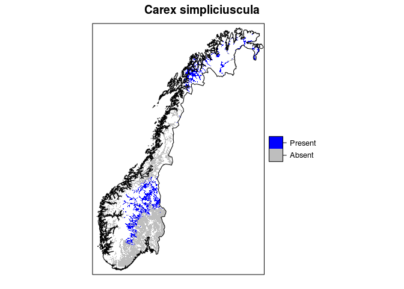 They are the same areas for the Carex species. They are not NA cells, just absent cells.

``` r
Carex_simpliciuscula_pa2
#> class      : RasterLayer 
#> dimensions : 1628, 1115, 1815220  (nrow, ncol, ncell)
#> resolution : 1000, 1000  (x, y)
#> extent     : 229758.4, 1344758, 6397776, 8025776  (xmin, xmax, ymin, ymax)
#> crs        : +proj=utm +zone=32 +datum=WGS84 +units=m +no_defs +ellps=WGS84 +towgs84=0,0,0 
#> source     : memory
#> names      : layer 
#> values     : 0, 1  (min, max)
#> attributes :
#>  ID      pa
#>   0  Absent
#>   1 Present
```

I can use one of the original models to make a prediction and see if the problem precists.

``` r
p <- raster::predict(model = Carex_simpliciuscula_m[[1]], 
                     object = myIVs, filename =  'models/predictions/CsGLM1.img', overwrite=TRUE)
raster::plot(p)
```

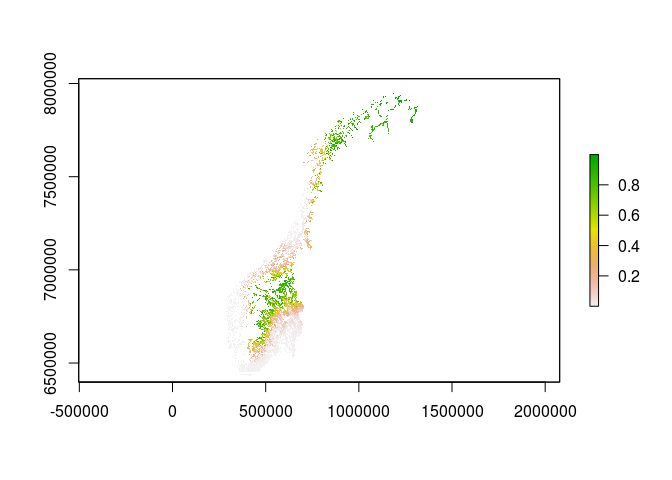 It's still there, so it's not the ensemble step.
