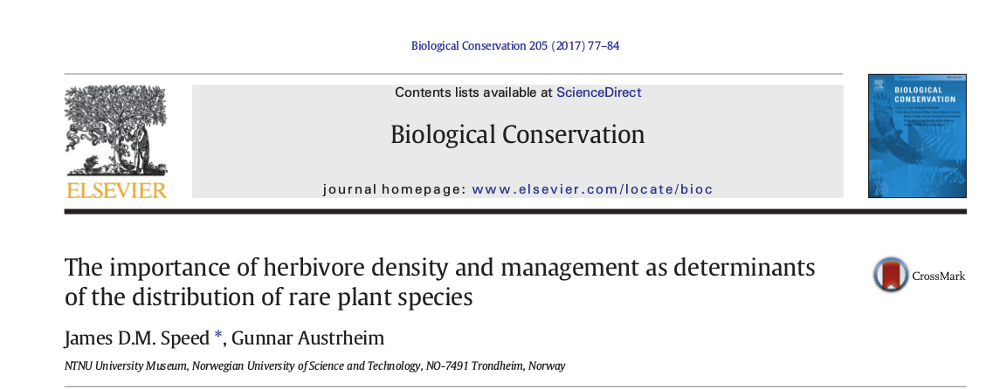

```{r setup, include=FALSE}
knitr::opts_chunk$set(echo = TRUE)

```


[HOME](https://anders-kolstad.github.io/sdmShiny) | 
[Setting up the IVs](https://anders-kolstad.github.io/sdmShiny/IV) |
[Downloading occurence data](https://anders-kolstad.github.io/sdmShiny/occurences) |
[Fitting SDMs](https://anders-kolstad.github.io/sdmShiny/sdm)

## Home
```{r, echo=FALSE}
knitr::include_app("https://anderskolstad.shinyapps.io/sdmShiny/")
```


### About
The sdmShiny project is for disseminating the species distribution modeling work done in James Speed's group at the NTNU University Museum. We will use web-based Shiny apps to present distribution maps of several species and allow these to change with the predictions of the SDM as the user tweaks the parameters for climate and herbivory. 

### Publications
[](https://www.sciencedirect.com/science/article/abs/pii/S0006320716309168)