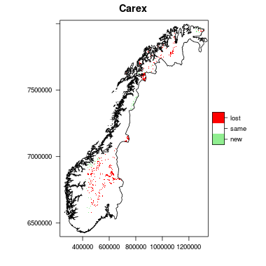
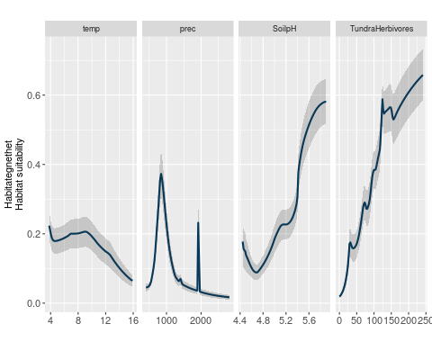
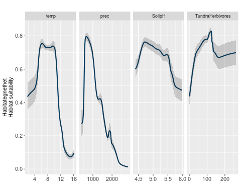
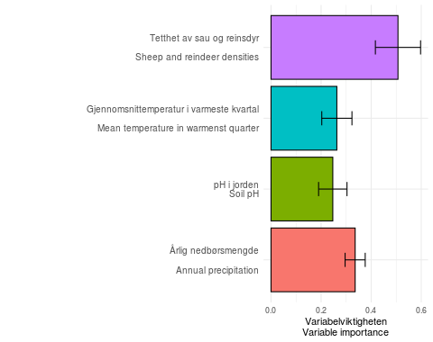
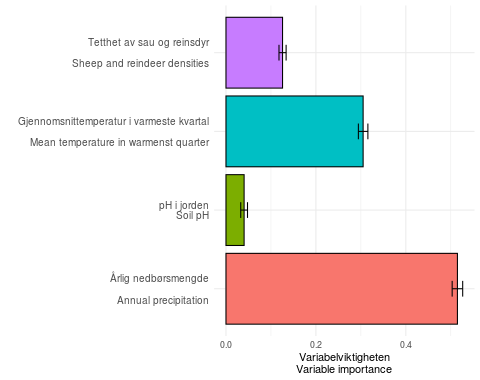

```{r setup, include=FALSE}
knitr::opts_chunk$set(echo = TRUE)

```


[HOME](https://anders-kolstad.github.io/sdmShiny) | 
[Setting up the IVs](https://anders-kolstad.github.io/sdmShiny/IV) |
[Downloading occurence data](https://anders-kolstad.github.io/sdmShiny/occurences) |
[Fitting SDMs](https://anders-kolstad.github.io/sdmShiny/sdm)

## Documentation: Fitting SDM models
Last update:
```{r}
Sys.time()
```


Now we have all we need to make a model. I will save all model objects and use them for making predictions live in the application. The two test species are alpine red listed plants, so I'll use the IV from the alpine paper. Actually, I'll drop bio15 as it was so unimportant. I'll create 1000 random pseudo absences across the goegraphical area (Norway I suppose). To avoid struggling too much with subsetting these strange sdm objects, I will run one set of models for each species, although I know that in sdm::sdm you can specify multiple species.

This code chunk will get us up to speed.
```{r}
library(sdm)
myIVs              <- raster:: stack('data/IV.grd')
source("./R/spList.R")
mySpecies <- sl()
mySpecies3 <- mySpecies[mySpecies == c("Primula scandinavica", "Kobresia simpliciuscula")]
oDat <- readRDS('data/large/oDat.RData')
```

## SDM-data object
```{r, eval=FALSE}
for(i in 1:length(mySpecies3)){
  s    <- unique(oDat$species)[i]
  s2   <- paste0(s, "_d")
  d    <- oDat[oDat$species == s,]
  dat  <- sdm::sdmData(species~temp+prec+SoilpH+TundraHerbivores,
                   train = d,
                   predictors = myIVs,
                   bg = list(n=1000, method = "gRandom"))
  
  # assign(s2, dat)
  sdm::write.sdm(dat, paste0("models/sdmData/", s2), overwrite=TRUE)
}

```
This takes the names over to the gbif approved names (Kobresia to Carex). Perhaps it's for the best. (Hmm, no, that'll make it more difficult to find the model object in the folders when there are tens of models. )

This code could bring the sdmData back in into the environment, but I don't need it now:
```{r, eval=FALSE}
for(i in 1:length(mySpecies3)){
  s    <- unique(oDat$species)[i]
  s2   <- paste0(s, "_d")
  s3   <- paste0("models/sdmData/", s, "_d.sdd")
  assign(s2, sdm::read.sdm(s3))
}
```


## 5 x 3 models
We don't have any independent test data so I'll use bootstrapping to partition test data, and I'll do that 5 times. I shouldn't do much less because there are very few data points for some of the species, like P scandinavica. I think records from inside the same 1km cells will be counted as duplicates and removed. I will use 3 methods as well, resulting in 3 x 5 = 15 models per species. It takes about 1 min to run this.

```{r, eval=FALSE}
for(i in 1:length(mySpecies3)){
  
  s       <- unique(oDat$species)[i]
  file1   <- paste0("models/sdmData/", s, "_d.sdd")
  obj     <- paste0(s, "_m")
  file2   <- paste0("models/sdmModels/", obj)
  d      <- sdm::read.sdm(file1)
  
  mod <- sdm::sdm(.~.,
              data = d, 
              methods = c('glm', 'gam', 'maxent'),   
              replication = c('boot'), n=5)     
  
  sdm::write.sdm(mod, file2, overwrite=TRUE)
  
}

```
Depending on methods, these are some common warning:
Warning 1: *prediction from a rank-deficient fit may be misleading*
Warning 2: *The response has five or fewer unique values.  Are you sure you want to do regression?* I think this was mainly due to random forest method on small sample sizes.

*Technical note: I seems to not be possible to print characters inside the sdm function formula, and therefore we neede seperate sdmData files for each species. I.e. the following fails.*
```{r, eval=FALSE}
for(i in 1:length(mySpecies3)){
  s <- unique(oDat$species)[i]
  d <- get(paste0(s, "_d"))
  mod <- sdm::sdm(paste(s)~.,     # also tried noquote, eval, and  print(quote = F)...
              data = d, 
              methods = c('glm', 'gam', 'rf'),   
              replication = c('boot'), n=3)
    assign(paste0(s, "_mxxx"), 
         mod)
}
```


Let's bring the models back in to the environment. They're 3-20 20 MB each on file, or 17-55 when unzipped in the environment.
```{r}
for(i in 1:length(mySpecies3)){
  s      <- unique(oDat$species)[i]
  s2     <- paste0(s, "_m")
  file   <- paste0("models/sdmModels/", s2, ".sdm")
  
  assign(s2, sdm::read.sdm(file))
}
```


```{r}
Carex_simpliciuscula_m
```

```{r}
Primula_scandinavica_m
```
GAMs fail when land class is included.
RF is not perhaps suitable for such low sample sizes, and when I change from rf to maxent as the third model I removed large white areas in the ensamble map.

```{r}
(ev1 <- sdm::getEvaluation(Primula_scandinavica_m, stat = c("AUC", "threshold")))
```
Note the large variation in the threshold value. Density plots show many models have problems discriminating. The maxent models 11-15 are perhaps the most stable. Note also that you can have a 'good model' with high AUC and at the same time a threshold close to 1. Then something is wrong. A very variable threshold value makes it risky to make presense absense maps as I do below.
```{r}
(ev2 <- sdm::getEvaluation(Carex_simpliciuscula_m, stat = c("AUC", "threshold")))
```
The Carex models are much more stable. Lets compare.
```{r}
df <- rbind(ev1, ev2)
df <- data.frame(species   = rep(c("Primula", "Carex"), each = 15),
                 threshold = df$threshold,
                 AUC       = df$AUC )
par(mfrow = c(1,2))
boxplot(threshold~species, data = df)
boxplot(AUC~species, data = df)

```
I would not make a presence absence map for the Primula with threshold values being so fluctuating. Either I make probability maps for all, or I drop some species out. The AUCs is more stable, but some replicated partitioning seems warranted. The trade off here is with processing time for this thing to be able to run live predictions.


### Ensemble
Lets put the 5 x 3 models together and make a map of the current habitat suitability, using ensamble. Runtime approx. 1 min.
```{r, eval=FALSE}
for(i in 1:length(mySpecies3)){
  s <- unique(oDat$species)[i]
  d <- get(paste0(s, "_m"))
  
  # using this because overwrite=TRUE don't work
  fn <- paste0("models/predictions/", s, "_ens.img")
  if(file.exists(fn)){file.remove(fn)}
  
  mod <- sdm::ensemble(d,
              newdata = myIVs, 
              filename = fn, overwrite=TRUE,   
              setting = list(method='weighted', stat = 'AUC')
              )     
  assign(paste0(s, "_ens"), 
         mod)
}
```
Lets plot them.
```{r}
Primula_scandinavica_ens <- raster::raster("models/predictions/Primula_scandinavica_ens.img")
raster::plot(Primula_scandinavica_ens, main = "Habitat suitability for Primula scandinavica")
raster::plot(oDat[oDat$species == "Primula_scandinavica",], add=T, cex = 0.8, pch = 1)
```
The realised nishe is considerably smaller then the desirable or fundamental nishe.

```{r}
Carex_simpliciuscula_ens <- raster::raster("models/predictions/Carex_simpliciuscula_ens.img")
raster::plot(Carex_simpliciuscula_ens, main = "Habitat suitability for Carex simpliciuscula")
raster::plot(oDat[oDat$species == "Carex_simpliciuscula",], add=T, cex = 0.2)
```


### Presence-absence map
For most people I think presence-absence is more understandable than probability of occurence (but see discussion about threshold values above). Let's use mean threshold value for defining p-a and plot a discrete map instead. Also, I like to think of this as habitat suitability rather than distribution per se, and we can name the categories 'suitable' or 'unsuitable' rather then 'present' and 'absent'. Then the next map of 'collonisation' and 'extinction' could be classes as 'new habitat' and 'lost habitat'. 
```{r}
for(i in 1:length(mySpecies3)){
  s <- as.name(paste0(unique(oDat$species)[i], "_m"))
  ev <- paste0(unique(oDat$species)[i], "_ev")
  assign(ev, sdm::getEvaluation(eval(s), 
                   stat = c('AUC', 'threshold', 'TSS'), opt = 2)
  )
}
```

```{r}
for(i in 1:length(mySpecies3)){
  ens    <- get(paste0(unique(oDat$species)[i], "_ens"))
  ev     <- get(paste0(unique(oDat$species)[i], "_ev"))
  s      <- paste0(unique(oDat$species)[i], "_pa")
  
  
  ens[]   <- ifelse(ens[] >= mean(ev$threshold), 1, 0)
  assign(s, ens)
}
```


```{r}
Primula_scandinavica_pa2 <- raster::ratify(Primula_scandinavica_pa)
lev <- raster::levels(Primula_scandinavica_pa2)[[1]] 
lev$pa <- c("Unsuitable habitat", "Suitable habitat")
levels(Primula_scandinavica_pa2) <- lev
source("R/norway.R")
nor <- norway(lonlat = FALSE)
library(latticeExtra)
rasterVis::levelplot(Primula_scandinavica_pa2, 
                   margin=F,
                   main="Primula scandinavica",
                   scales=list(draw=F),
                   col.regions= c("grey", "blue"))+
  layer(sp::sp.polygons(nor),col=grey(0.5))+
  layer(sp::sp.points(oDat[oDat$species == "Primula_scandinavica",], pch = 1, cex = 0.8, col = "black", lwd = 0.5, alpha = 0.7))
```
This map has changes drastically between runs!!, indicating that 5*3 is not enough for it to stabilise. 

```{r}
Carex_simpliciuscula_pa2 <- raster::ratify(Carex_simpliciuscula_pa)
lev <- raster::levels(Carex_simpliciuscula_pa2)[[1]] 
lev$pa <- c("Unsuitable habitat", "Suitable habitat")
levels(Carex_simpliciuscula_pa2) <- lev

rasterVis::levelplot(Carex_simpliciuscula_pa2, 
                   margin=F,
                   main="Carex simpliciuscula",
                   scales=list(draw=F),
                   col.regions= c("grey", "blue"))+
  layer(sp::sp.polygons(nor),col=grey(0.5))+
layer(sp::sp.points(oDat[oDat$species == "Carex_simpliciuscula",], pch = 1, cex = 0.8, col = "black", lwd = 0.5, alpha = 0.7))
```
Nice map. Easy to read and understand to laymen I think.


## Best candidate model

To make predictions from the 5 x 3 models we need to run the ensamble function again, this time with altered IVs in the newdata argument. The function is probably too slow to run on the fly. This I need to test on the io server later. We could choose one method, eg maxent, and just use that for all species, and with only one replication. Then we could use the predict function in raster which will be quicker. Or we can look at these 15 models we have generated and choose the best one from there. That would be a bit safer.

```{r}
Primula_scandinavica_ev
```

Based on AUC, model nr ...
```{r}
which.max(Primula_scandinavica_ev$AUC)
```
is the best for the Primula. But the threshold is super low.

```{r}
Carex_simpliciuscula_ev
```
Based on AUC, model nr ...
```{r, echo=FALSE}
which.max(Carex_simpliciuscula_ev$AUC)
```
is the best for the Carex.


Let's compare the ensemble with the best candidate model.


```{r}
for(i in 1:length(mySpecies3)){
  s <- unique(oDat$species)[i]
  s2 <- paste0(s, "_m")
  s3 <- get(paste0(s, "_ev"))
  file <- paste0("models/sdmModels/", s, "_bcm")
  best <- s3$modelID[s3$AUC == max(s3$AUC)]
  mod <- get(s2)
  mod2 <- mod[[best]]
  sdm::write.sdm(mod2, file, overwrite=TRUE)

  
  
  mod3 <- raster::predict(mod2,
              object = myIVs, 
              filename = paste0("models/predictions/", s, "_best.img"), 
              overwrite=TRUE)
                
  assign(paste0(s, "_best"), 
         mod3)
}
```


```{r}
par(mfrow=c(2,2))
raster::plot(Primula_scandinavica_best, main = "Best candidate model\nfor Primula")   
raster::plot(Primula_scandinavica_ens, main = "Ensemble model\nfor Primula")
raster::plot(Carex_simpliciuscula_best, main = "Best candidate model\nfor Carex")   
raster::plot(Carex_simpliciuscula_ens, main = "Ensemble model\nfor Carex")
```
The models change considerably between runs, sometimes ending up with incomplete coverage (white areas on the map). The strange thing is that when that happens, it's the same for both species.
```{r}
tt  <- Carex_simpliciuscula_best > -Inf
tt2 <- Primula_scandinavica_best > -Inf
par(mfrow = c(1,2))
raster::plot(tt, main = "Carex")
raster::plot(tt2, main = "Primula")
```


The following script makes these comparisons with presence absence map, but thats not so important.
```{r, eval=FALSE}
for(i in 1:length(mySpecies3)){
  p    <- get(paste0(unique(oDat$species)[i], "_best"))
  ev     <- get(paste0(unique(oDat$species)[i], "_ev"))
  th     <- ev$threshold[ev$AUC == max(s3$AUC)]
  s      <- paste0(unique(oDat$species)[i], "_pab")
  
  
  p[]   <- ifelse(p[] >= mean(ev$threshold), 1, 0)
  assign(s, p)
}


# Find divergent areas for the Primula

ps <- Primula_scandinavica_pa2 - Primula_scandinavica_pab
ps <- raster::ratify(ps)
ratlcp <- raster::levels(ps)[[1]]
ratlcp[['errors']] <- 
  c('new',
    'same',
    'lost')
levels(ps) <- ratlcp


# Find divergent areas for the Carex

cs <- Carex_simpliciuscula_pa2 - Carex_simpliciuscula_pab
cs <- raster::ratify(cs)
ratlcp <- raster::levels(cs)[[1]]
ratlcp[['errors']] <- 
  c('new',
    'same',
    'lost')
levels(cs) <- ratlcp


cols <- colorRampPalette(c("lightgreen", "white", "red" ))

# save as pictures to save knitr time
png("figures/comparisons/Primula.png", height = 380, width = 380, units = "px")
rasterVis::levelplot(ps, col.regions = cols, main = "Primula")+
  layer(sp::sp.polygons(nor),col=grey(0.5))
dev.off()
png("figures/comparisons/Carex.png", height = 380, width = 380, units = "px")
rasterVis::levelplot(cs, col.regions = cols, main = "Carex")+
  layer(sp::sp.polygons(nor),col=grey(0.5))
dev.off()
```


In conclusion I think we ideally should to replicate the partitioning because of the low sample sizes, but if that takes too long to process it not impossible to do the 'single best' approach, ie to find the best out of 15 candidate models and use that. This is better than choosing on method, ie maxent, and one of a few replicates, because our test showed that on some runs actually the GAMs were better. Then should use the probabilities and not the presence-absence maps, because of the large variation in the threshold value between model runs. If the 'single best models differs from the ensemble that may not be a problem as the change in predictions when altering the IVs (the input values) should be qualitatively similar, which is good enough for our purpose. Also, the ensemble prediction includes a lot of crap models so it's not neccessarily better.

## Replicated single method
This approach chooses one method, maxent, and does five replicated partitionings, and then the raster::predict function to make maps. I'll keep these models to to a speed test later in the actuall Shiny app on the io server.
```{r}
for(i in 1:length(mySpecies3)){
  
  s       <- unique(oDat$species)[i]
  file1   <- paste0("models/sdmData/", s, "_d.sdd")
  obj     <- paste0(s, "_ms")
  obj2     <- paste0(s, "_5maxent")
  file2   <- paste0("models/sdmModels/", obj)
  d      <- sdm::read.sdm(file1)
  
  mod <- sdm::sdm(.~.,
              data = d, 
              methods = 'maxent',   
              replication = c('boot'), n=5)     
  
  sdm::write.sdm(mod, file2, overwrite=TRUE)
  assign(obj, mod)
  
  mod2 <- raster::predict(mod,
              object = myIVs,
              mean = T,
              filename = paste0("models/predictions/", obj2, ".img"), 
              overwrite=TRUE)
  assign(obj2, mod2)

  ev     <- sdm::getEvaluation(mod, stat = "threshold")
  th     <- mean(ev$threshold)
  s      <- paste0(unique(oDat$species)[i], "_5maxent_pa")
  mod2[] <- ifelse(mod2[] >= th, 1, 0)
  assign(s, mod2)

}
```

Check coverage. Some runs gives white spots on this map.
```{r}
tt <- Primula_scandinavica_5maxent > -Inf
raster::plot(tt)
```
```{r}
raster::plot(Primula_scandinavica_5maxent, main = "Habitat suitability\nPrimula, 5x maxent")
```

```{r}
getEvaluation(Primula_scandinavica_ms)
```


Compare 'best candidate' with 'five best maxent'
```{r}
diffpa <- Primula_scandinavica_best - Primula_scandinavica_5maxent_pa
raster::plot(diffpa)
```
Obs, plot changes between updates. 


## Response curves
Let make response curve plots for each species and save those as well. These are the mean responses for the 5 x 3 models.
```{r}


for(i in 1:length(mySpecies3)){
  s      <- unique(oDat$species)[i]
  s2     <- paste0(s, "_m")
  s3     <- paste0("models/rcurves/", s, "_rcurves.png")
  d      <- get(s2)
  d2     <- d
 
p <- sdm::rcurve(d2, ylab="Habitategnethet\nHabitat suitability", 
                 xlab = "",
                 main = "")
# not sure how to rename the variables:
#labs <- c("Temperature", "Precipitation", 
#           "Soil pH", "Sheep and reindeer")
# p2 <- p + facet_grid(labeller = labeller(variable = labs))

png(filename = s3,
    width = 480, height = 380, units = "px")
  print(p)
  dev.off()

}
```



## Variable importance
I would also like to get a plot of the variable importance. This script uses the combined/averaged impirtances from the 5*3 models.
```{r}
# create empty list
varimp <- list()

# list of IVs (different for alpine and forest species). 
# Make sure to put them in the correct order. 
# Find the order with > getVarImp(yourModel, id = 1)@varImportance
IV <- c("temp", "prec", "SoilpH", "TundraHerbivores")

# Create an empty varimp table
df1 <- data.frame(variables = IV,
                  corTest = as.numeric(NA),
                  AUCtest = as.numeric(NA))
                  
for(i in 1:length(mySpecies3)){
  s      <- unique(oDat$species)[i]
  s2     <- paste0(s, "_m")
  d      <- get(s2)
  tab    <- d@run.info

for(t in 1:max(tab$modelID)){
  r <- length(varimp)+1
  ifelse(tab$success[t]==TRUE,
           varimp[[r]]          <-sdm::getVarImp(d,id=t)@varImportance,
           varimp[[r]]          <- df1)
         
           varimp[[r]]$species  <-tab$species[t]
           varimp[[r]]$method   <-tab$method[t]
           varimp[[r]]$repid    <-tab$replicationID[t]      
         
   #if(tab$success[t]==FALSE) return(print(paste('Model failiure run ',t)))
}
}

varimp<-do.call('rbind',varimp)
rm(s, s2, d, tab, df1)
source("R/se.R")
varimpmean <- aggregate(data = varimp,
                        corTest ~ species + variables,
                        FUN = function(x) c(mean = mean(x, na.rm=T), se = se(x)))
varimpmean <- do.call(data.frame, varimpmean)
head(varimpmean)
```

Changing the variable names for axis tick labels
```{r}
varimpmean$variables <- plyr::revalue(varimpmean$variables, c(
              prec         = "Årlig nedbørsmengde\n
                              Annual precipitation",
              SoilpH       = "pH i jorden\nSoil pH",
              temp         = "Gjennomsnittemperatur i varmeste kvartal\n
                              Mean temperature in warmenst quarter",
              TundraHerbivores = "Tetthet av sau og reinsdyr\n
                                  Sheep and reindeer densities"))

```

We can make one plot per species and show it in the app. That way the user will know what slider should induce the biggest effect.
```{r, eval=FALSE}
library(ggplot2)

for(i in 1:length(unique(varimpmean$species))){
  
  d <- varimpmean[varimpmean$species==unique(varimpmean$species)[i],]
  s <- paste0("./models/varimp/",
              unique(varimpmean$species)[i],
              ".png")
  
  p <- ggplot2::ggplot(data = d)+
  geom_bar(aes(y = corTest.mean, 
               x = variables, 
               fill = variables), 
           stat = "identity", 
           colour = "black")+
  coord_flip()+
  ylab("Variabelviktigheten\nVariable importance")+
  xlab("")+
  theme_minimal()+
  theme(axis.text.y = element_text(size = 10))+
  theme(legend.position="none")+
  geom_errorbar(aes(x = variables, ymin=corTest.mean-corTest.se, ymax=corTest.mean+corTest.se), width=.2)

  png(filename = s,
    width = 480, height = 380, units = "px")
  print(p)
  dev.off()
}
```


